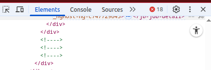

# How to detect if a page is made with Angular (still in 2025)

## The symptom

## The reason

Still valid: cf. [Stack Overflow: Empty comments in Angular application](https://stackoverflow.com/q/44167890/15979256)

## The problem

Not every HTML parser implements [the optionality for a text](https://html.spec.whatwg.org/multipage/syntax.html#comments) between `<!--` and `-->` in a way that `<!----> is recognized as `<!--` immediately followed by `-->`.
